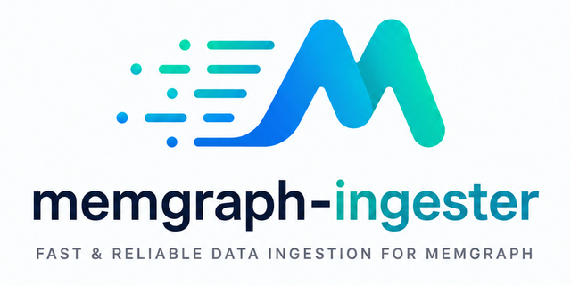

# memgraph-ingester
# Structure-aware RAG for code and project knowledge

[](https://central.sonatype.com/artifact/io.github.ousatov-ua/memgraph-ingester)
[](https://opensource.org/licenses/MIT)
[](https://github.com/ousatov-ua/memgraph-ingester)
[](https://github.com/ousatov-ua/memgraph-ingester/commits/main)
[](https://github.com/ousatov-ua/memgraph-ingester/commits/main)
[](#3-ingest-java)
[](#4-ingest-javascript-or-typescript)
[](#5-ingest-python)
[](#6-ingest-any-language)



`memgraph-ingester` indexes source files into [Memgraph](https://memgraph.com/) so AI agents can
query a real code graph instead of repeatedly scanning raw files. It is RAG-enabled, but not as a
loose pile of text chunks: retrieval is derived from code structure and connected back to files,
symbols, relationships, and durable project knowledge.

Languages supported:
- **Java**
- **JavaScript/TypeScript**
- **Python**
- **Ctags-detected fallback languages** such as Ruby, Go, Rust, Kotlin, C, and C++ for structural
  inventories when no first-class adapter owns the file extension.

Optionally, it can also enable **memories** for durable project rules.

Use it when you want your agent to quickly answer questions such as:

- What classes, methods, files, and packages exist?
- What extends or implements this type?
- Who calls this method?
- What durable project rules, decisions, findings, risks, and tasks should the agent remember?

The normal path is simple:

1. Run Memgraph.
2. Download one ingester executable.
3. Run one command; the ingester selects Java, JS/TS, Python, or ctags fallback logic from each
   source file extension.
4. Connect your AI agent through MCP or `mgconsole`.

No source code is uploaded by the ingester. It reads local files, writes graph nodes to your
Memgraph instance over Bolt, and exits.

## Structure-Aware RAG

RAG support is built on derived graph nodes, not detached text blobs.

- `CodeChunk` rows are generated from parsed code structure and linked back to canonical `File`,
  `Class`, `Interface`, `Annotation`, `Method`, and `Field` nodes.
- `MemoryChunk` rows are generated from optional Memory records such as decisions, rules, findings,
  tasks, risks, and questions, including their `CodeRef` links.
- Code embeddings are enabled by default. Memory embeddings are enabled by default when
  `--with-memories` or `--wipe-memory-rag` is used. Use `--no-code-embeddings` or
  `--no-memory-embeddings` to skip them.

Agents can search semantically first, then verify the result through exact graph relationships and
source locations.

## Safety First

The ingester is designed to be safe to try.

| Area | What happens |
|---|---|
| Project isolation | Every code and memory node is scoped by `--project`. Multiple repos can share one Memgraph instance. |
| Normal re-ingestion | `--wipe-project-code` deletes only the code graph for that `--project`. Other projects stay untouched. |
| Memory protection | Memory is not deleted unless you explicitly pass `--wipe-project-memories`. |
| Full database wipe | `--wipe-all` deletes all Memgraph data. Use it only when you intentionally want an empty database. |
| Schema setup | `--apply-schema` is safe to re-run. Existing constraints and indexes are skipped by Memgraph. |
| Java parsing | Java source is parsed locally with JavaParser. Dependencies are optional and only improve symbol resolution. |
| JS/TS parsing | The ingester can manage its own Node.js and TypeScript parser locally. You do not have to install Node.js. |
| Python parsing | The ingester can manage its own standalone CPython runtime and private venv locally. You do not have to install Python. |
| Ctags fallback | The ingester can manage its own Universal Ctags executable locally. You do not have to install ctags. |

For JS/TS, Python, and ctags fallback, managed runtime mode is explicit and controlled:

- Default mode is `--js-runtime-mode managed`.
- Default mode is `--python-runtime-mode managed`.
- Default mode is `--ctags-runtime-mode managed`.
- Managed mode downloads pinned Node.js `22.11.0` from `nodejs.org`.
- It verifies Node.js with the official SHA-256 checksum before extracting.
- It downloads pinned TypeScript `5.6.3` from the npm registry.
- It verifies the TypeScript package with SHA-512 integrity metadata.
- Managed Python downloads pinned standalone CPython `3.14.5` from python-build-standalone.
- It verifies CPython with the release `SHA256SUMS` file before extracting.
- It creates a private Python venv under `~/.cache/memgraph-ingester` by default.
- Managed ctags downloads an official Universal Ctags release asset and verifies SHA-256 when the
  release publishes a digest.
- With `--ctags-version latest`, a ready cached ctags install is reused before checking GitHub
  release metadata.
- It caches parser runtimes under `~/.cache/memgraph-ingester` by default.
- It never installs Node.js globally.
- It never installs Python globally.
- It never runs `npm install` in your project.
- It never imports your Python project packages or runs your Python application code.
- It never runs source files through ctags; ctags only reads files to emit tags.
- It skips `node_modules` during source ingestion and watch registration.
- The Python adapter skips common Python environment/cache directories such as `.venv`, `venv`,
  `site-packages`, `__pycache__`, `build`, and `dist`.

If you do not want the ingester to download Node.js, use your own Node.js:

```bash
<ingester> \
  --source . \
  --bolt bolt://localhost:7687 \
  --project my-js-project \
  --js-runtime-mode system \
  --wipe-project-code \
  --init-instructions \
  --apply-schema
```

If you want no network access during JS/TS ingestion, warm the cache once and then use offline mode:

```bash
<ingester> --check-js-runtime

<ingester> \
  --source . \
  --bolt bolt://localhost:7687 \
  --project my-js-project \
  --js-runtime-mode offline \
  --init-instructions \
  --wipe-project-code
```

## Requirements

For normal use:

- Memgraph, either local, Docker, or an existing Bolt endpoint.
- One ingester download from the release page.

Runtime requirements by artifact:

| Artifact | Java required? | Node.js required for JS/TS? | Python required for Python? | Ctags required for fallback? |
|---|---:|---:|---:|---:|
| Native executable | No | No, managed mode handles it | No, managed mode handles it | No, managed mode handles it |
| Shaded JAR | Java 25 JRE | No, managed mode handles it | No, managed mode handles it | No, managed mode handles it |

Optional tools:

- `memgraph-ingester-mcp`, if you want agents to query the graph through high-level MCP tools.
- `mgconsole`, if you want to query Memgraph directly without MCP.
- Node.js, Python 3.9+, or Universal Ctags only when you explicitly choose
  `--js-runtime-mode system`, `--python-runtime-mode system`, or `--ctags-runtime-mode system`.
  Set `MEMGRAPH_INGESTER_PYTHON` to override the system Python executable, or
  `MEMGRAPH_INGESTER_CTAGS` to override the system ctags executable.
- Maven, only if you want a richer Java classpath or you want to build from source.
- Java 25 SDK, only if you build from source.

## Quick Start

### 1. Start Memgraph

```bash
docker run -p 7687:7687 -p 7444:7444 --name memgraph memgraph/memgraph-mage:3.9.0
```

Memgraph Bolt listens on `bolt://localhost:7687`.

### 2. Download the Ingester

Version in this repository: `12.0.28`.

| Platform | Download                                                                                                                                              |
|---|-------------------------------------------------------------------------------------------------------------------------------------------------------|
| Java shaded JAR | [memgraph-ingester.jar.zip](https://github.com/ousatov-ua/memgraph-ingester/releases/download/v12.0.28/memgraph-ingester.jar.zip)                     |
| Linux AMD64 | [memgraph-ingester-linux-amd64.zip](https://github.com/ousatov-ua/memgraph-ingester/releases/download/v12.0.28/memgraph-ingester-linux-amd64.zip)     |
| macOS ARM64 | [memgraph-ingester-macos-arm64.zip](https://github.com/ousatov-ua/memgraph-ingester/releases/download/v12.0.28/memgraph-ingester-macos-arm64.zip)     |
| Windows AMD64 | [memgraph-ingester-windows-amd64.zip](https://github.com/ousatov-ua/memgraph-ingester/releases/download/v12.0.28/memgraph-ingester-windows-amd64.zip) |

For native downloads:

```bash
unzip memgraph-ingester-macos-arm64.zip
chmod +x memgraph-ingester-macos-arm64
./memgraph-ingester-macos-arm64 --help
```

For the JAR:

```bash
java -jar /path/to/memgraph-ingester.jar --help
```

In commands below, replace `<ingester>` with either the native executable path or
`java -jar /path/to/memgraph-ingester.jar`.

### 3. Ingest Java

Simple Java ingestion:

```bash
cd /path/to/your/java/project

<ingester> \
  --source src/main/java \
  --bolt bolt://localhost:7687 \
  --project my-java-project \
  --init-instructions \
  --wipe-project-code \
  --apply-schema
```

Note: If you want to use memories too, then add `--with-memories`.

Better Java symbol resolution for Maven projects:

```bash
cd /path/to/your/java/project

CP=$(mvn -q dependency:build-classpath -DincludeScope=test -Dmdep.outputFile=/dev/stdout 2>/dev/null)

<ingester> \
  --source src/main/java \
  --bolt bolt://localhost:7687 \
  --project my-java-project \
  --init-instructions \
  --classpath "$CP" \
  --wipe-project-code \
  --apply-schema
```

What the classpath improves:

- Fully qualified external types.
- More complete `EXTENDS` and `IMPLEMENTS` edges.
- More complete method signatures.
- More complete best-effort `CALLS` edges.

### 4. Ingest JavaScript or TypeScript

Managed mode needs no user-installed Node.js:

```bash
cd /path/to/your/js/project

<ingester> \
  --source . \
  --bolt bolt://localhost:7687 \
  --project my-js-project \
  --wipe-project-code \
  --init-instructions \
  --apply-schema
```

Optional preflight check, without connecting to Memgraph:

```bash
<ingester> --check-js-runtime
```

This downloads and verifies the managed parser runtime if needed, then runs a local parser smoke
test against temporary JS files.

### 5. Ingest Python

Managed mode needs no user-installed Python:

```bash
cd /path/to/your/python/project

<ingester> \
  --source . \
  --bolt bolt://localhost:7687 \
  --project my-python-project \
  --wipe-project-code \
  --init-instructions \
  --apply-schema
```

Optional preflight check, without connecting to Memgraph:

```bash
<ingester> --check-python-runtime
```

This downloads and verifies the managed standalone CPython runtime if needed, creates the private
parser venv, then runs a local parser smoke test against temporary Python files.

### 6. Ingest Other Ctags-Detected Languages

Managed ctags mode needs no user-installed ctags. It is a fallback after Java, JS/TS, and Python,
so first-class adapters still own their extensions:

```bash
cd /path/to/your/mixed/project

<ingester> \
  --source . \
  --bolt bolt://localhost:7687 \
  --project my-mixed-project \
  --wipe-project-code \
  --init-instructions \
  --apply-schema
```

Optional preflight check, without connecting to Memgraph:

```bash
<ingester> --check-ctags-runtime
```

Ctags fallback writes files, packages, synthetic module owners, types, methods, and fields under the
detected graph language. It does not promise call graphs or language-specific semantic resolution.

### 7. Verify the Graph

With `memgraph-ingester-mcp`, ask your agent to call `server_status` for the project and confirm
that languages and vector indexes are present.

With `mgconsole`:

```bash
mgconsole --host localhost --port 7687 --output-format=csv
```

Then:

```cypher
MATCH (p:Project {name: 'my-project'})-[:CONTAINS]->(l:Language)-[:CONTAINS]->(c:Code)
RETURN p.name, l.name, c.sourceRoots, c.lastIngested
ORDER BY c.lastIngested DESC;
```

You should see your project name and a fresh `lastIngested` timestamp.

## Common Commands

### Re-ingest after code changes

```bash
<ingester> \
  --source src/main/java \
  --bolt bolt://localhost:7687 \
  --project my-java-project
```

Regular re-ingestion prunes graph state for source files that were deleted and for declarations or
file-local relationships removed from changed files. Use `--wipe-project-code` only when you want a
fresh project code graph before ingestion starts.
Changed-file cleanup and replacement writes are committed per file, including with `--threads > 1`.
Retained snapshots include active-source files, existing same-root graph files, and existing files
from other source roots. Re-ingestion refreshes retained files after deletes with the retained
file's source root. Watch re-ingestion also skips delete cleanup after update failures, retries
snapshot-failed batches, and reconciles delete-only snapshot failures.

### Faster re-runs

Use `--incremental` to skip files whose filesystem `lastModified` timestamp matches the graph:

```bash
<ingester> \
  --source src/main/java \
  --bolt bolt://localhost:7687 \
  --project my-java-project \
  --incremental
```

### Watch mode

Use `--watch` to keep the graph fresh while editing:

```bash
<ingester> \
  --source src/main/java \
  --bolt bolt://localhost:7687 \
  --project my-java-project \
  --watch
```

Watch mode recursively watches the source tree, debounces rapid saves, re-ingests changed files,
and removes graph state for deleted files.

### Fresh project code and memory

This is safe for the named project, but it deletes that project's memory:

```bash
<ingester> \
  --source src/main/java \
  --bolt bolt://localhost:7687 \
  --project my-java-project \
  --wipe-project-code \
  --wipe-project-memories \
  --apply-schema
```

### Multiple projects in one Memgraph instance

```bash
<ingester> -s ~/code/repo-a/src/main/java -b bolt://localhost:7687 -P repo-a --wipe-project-code
<ingester> -s ~/code/repo-b/src/main/java -b bolt://localhost:7687 -P repo-b --wipe-project-code
```

List indexed projects:

```cypher
MATCH (p:Project)-[:CONTAINS]->(l:Language)-[:CONTAINS]->(c:Code)
RETURN p.name, l.name, c.sourceRoots, c.lastIngested
ORDER BY c.lastIngested DESC;
```

## Java Guide

The Java adapter reads `.java` files using JavaParser with Java 25 syntax support. It should handle
most earlier Java versions as well.

Captured Java structure:

- Packages and files.
- Classes, interfaces, annotations, enums, records, and nested classes.
- Methods, constructors, fields, visibility, return types, static flags, line ranges, and synthetic flags.
- `EXTENDS`, `IMPLEMENTS`, `DECLARES`, `DEFINES`, `CONTAINS`, `ANNOTATED_WITH`, and best-effort `CALLS`.

Use `--classpath` whenever you can. Without dependency JARs, the ingester still works, but external
types may fall back to simple names and some call edges may be missing.

For Maven projects:

```bash
CP=$(mvn -q dependency:build-classpath -DincludeScope=test -Dmdep.outputFile=/dev/stdout 2>/dev/null)
```

Use `-DincludeScope=test` when you ingest tests or test fixtures. It includes JUnit, Testcontainers,
mocking libraries, and other test-scoped dependencies.

Generated code is indexed only if you ingest it:

```bash
<ingester> \
  --source target/generated-sources/annotations \
  --bolt bolt://localhost:7687 \
  --project my-java-project
```

Do not pass `--wipe-project-code` on the generated-source pass unless you want to replace the
previous graph with generated sources only.

## JavaScript and TypeScript Guide

JS/TS files are detected from their extensions during the normal `--source` scan.

Accepted source extensions:

- `.js`
- `.jsx`
- `.ts`
- `.tsx`
- `.mts`
- `.cts`
- `.d.ts`
- `.d.mts`
- `.d.cts`
- `.mjs`
- `.cjs`

Only source files under `--source` are considered. Use the repository root as `--source` when you
want root JavaScript config files or support scripts indexed alongside application source.
`tsconfig.json` and configs from its `extends` chain are read for TypeScript path aliases when
present, but they are not indexed as code nodes.

Skipped paths:

- Anything under `node_modules`.

Captured JS/TS structure:

- Files and synthetic module owners.
- Classes, named class expressions, and class expressions assigned to variables.
- Interfaces and type aliases as graph interfaces.
- Class/interface `EXTENDS` and class `IMPLEMENTS` relationships, including relative imports and
  `tsconfig.json` path aliases, including those inherited from extended configs, that resolve under
  `--source`.
- Interface and object-literal type members as `:Field`/`:Method` declarations.
- TypeScript enums as graph classes with `isEnum = true` and `kind = "enum"`, with enum members as
  `:Field` declarations using `kind = "enum-member"`.
- Top-level functions and variables under the module owner.
- Exported callable aliases and class re-export aliases as graph-visible declarations for their
  public export names.
- Methods, constructors, function-valued class fields, fields, abstract class metadata, bodyless
  abstract/optional method signatures, static flags, line ranges, and kinds.
- Decorators as annotations, preserving namespace-qualified decorator FQNs when possible.
- Angular decorators with framework metadata when detected.
- Syntax-based best-effort call edges, including top-level IIFEs/callbacks, local function
  constructors, typed `this.<property>` receivers for local classes, and deferred resolution for
  resolvable relative imports.
- Relative import and `tsconfig.json` path-alias resolution, including extended configs, prefers
  TypeScript source files over emitted JavaScript when both exist for the same local module path.

Runtime modes:

| Mode | Use when | Network |
|---|---|---|
| `managed` | You want the ingester to own the parser runtime. This is the default. | Downloads once if cache is missing. |
| `system` | You want to use `node` from `PATH`. | No Node download. TypeScript may still be managed unless already cached. |
| `offline` | You want no downloads and the cache is already warm. | No downloads. Fails if cache is missing. |

Custom cache:

```bash
<ingester> \
  --source . \
  --bolt bolt://localhost:7687 \
  --project my-js-project \
  --js-runtime-cache /path/to/cache \
  --wipe-project-code
```

Custom pinned versions:

```bash
<ingester> \
  --source . \
  --bolt bolt://localhost:7687 \
  --project my-js-project \
  --js-node-version 22.11.0 \
  --js-typescript-version 5.6.3 \
  --wipe-project-code
```

JS/TS caveat: JavaScript is dynamic. `CALLS` is not a complete raw AST call inventory; it records
known source call relationships when the helper can associate the site and target with graph
methods. Dynamic dispatch, dependency injection, monkey-patching, framework templates, and
generated code can produce missing call edges. A missing JS/TS `CALLS` edge does not prove a call
never happens. Repeated calls between the same caller and callee share one edge with a `count`
property for the observed occurrence count.

## Python Guide

Python files are detected from their extensions during the normal `--source` scan.

Accepted source extensions:

- `.py`
- `.pyi`

Skipped paths:

- `__pycache__`
- `.venv`
- `venv`
- `.tox`
- `.nox`
- `site-packages`
- `build`
- `dist`

Captured Python structure:

- Files and synthetic module owners.
- Classes and class `EXTENDS` relationships when relative imports resolve under `--source`.
- Top-level functions and variables under the module owner.
- Methods, constructors, fields, decorators, line ranges, and kinds.
- Syntax-based best-effort call edges for local functions and deferred owner/name calls for
  resolvable `self.method()` calls.

Runtime modes:

| Mode | Use when | Network |
|---|---|---|
| `managed` | You want the ingester to own the parser runtime. This is the default. | Downloads once if cache is missing. |
| `system` | You want to use Python 3.9+ from `PATH` or `MEMGRAPH_INGESTER_PYTHON`. | No CPython download. |
| `offline` | You want no downloads and the managed cache is already warm. | No downloads. Fails if cache is missing. |

Custom cache:

```bash
<ingester> \
  --source . \
  --bolt bolt://localhost:7687 \
  --project my-python-project \
  --python-runtime-cache /path/to/cache \
  --wipe-project-code
```

Custom pinned standalone CPython:

```bash
<ingester> \
  --source . \
  --bolt bolt://localhost:7687 \
  --project my-python-project \
  --python-version 3.14.5 \
  --python-build 20260510 \
  --wipe-project-code
```

Python caveat: Python is dynamic. The ingester parses syntax with CPython `ast`; it does not import
project modules, install project dependencies, or execute application code. Dynamic dispatch,
monkey-patching, imports outside `--source`, and generated code can produce missing call or
inheritance edges. A missing Python `CALLS` edge does not prove a call never happens.

## Agent Setup

The graph is useful directly, but it becomes much more powerful when your agent is told to use it.
The executable can write project-scoped Memgraph instructions to the agent's local instruction file.
It replaces its own previously managed block when one already exists, so rerunning the command keeps
`AGENTS.md`, `CLAUDE.md`, or another instruction file tidy.

Run the command from the repo you just ingested, using the same `--project` value.

Code graph guidance is installed by default:

```bash
memgraph-ingester --init-instructions -P my-project
memgraph-ingester -P my-project --instructions-agent codex
```

Add optional Memory workflow instructions when you want agents to create and maintain durable
Memgraph Memories:

```bash
memgraph-ingester --init-instructions -P my-project --with-memories
memgraph-ingester -P my-project --instructions-agent codex --with-memories
```

Use raw Memgraph/Cypher instructions when the agent will not have
`memgraph-ingester-mcp` available:

```bash
memgraph-ingester --init-instructions -P my-project --no-memgraph-ingester-mcp
memgraph-ingester --init-instructions -P my-project --with-memories --no-memgraph-ingester-mcp
```

Agent presets choose the default target file:

```bash
memgraph-ingester --init-instructions -P my-project --instructions-agent codex
memgraph-ingester --init-instructions -P my-project --instructions-agent claude
memgraph-ingester --init-instructions -P my-project --instructions-agent gemini
memgraph-ingester --init-instructions -P my-project --instructions-agent github
```

When `--instructions-agent` or `--no-memgraph-ingester-mcp` is present, `--init-instructions` is
optional.

Use `--instructions-file` to target a specific file:

```bash
memgraph-ingester -P my-project --instructions-file .github/copilot-instructions.md
```

Commit the updated instruction file so future agent sessions get the same graph guidance.

## MCP or mgconsole

MCP is optional. Agents should use
[`memgraph-ingester-mcp`](https://github.com/ousatov-ua/memgraph-ingester-mcp) for normal code graph
and memory work. It exposes high-level project-scoped tools instead of only raw Cypher.

Use `memgraph-ingester-mcp` when you want the agent to query the graph automatically.
Use `mgconsole` when you want direct, token-light Cypher output.

Install and run the MCP server from PyPI with `uvx`:

```bash
uvx memgraph-ingester-mcp
```

Common environment variables:

| Variable | Example | Purpose |
|---|---|---|
| `MEMGRAPH_INGESTER_MCP_BOLT_URI` | `bolt://localhost:7687` | Memgraph Bolt URI |
| `MEMGRAPH_INGESTER_MCP_READ_ONLY` | `false` | Disable memory write tools when `true` |

### Claude MCP

Minimal `.claude.json`:

```json
{
  "mcpServers": {
    "memgraphIngester": {
      "type": "stdio",
      "command": "uvx",
      "args": [
        "memgraph-ingester-mcp"
      ],
      "env": {
        "MEMGRAPH_INGESTER_MCP_BOLT_URI": "bolt://localhost:7687",
        "MEMGRAPH_INGESTER_MCP_READ_ONLY": "false"
      }
    }
  }
}
```

Verify:

```bash
claude mcp list
```

### Codex MCP

Minimal `~/.codex/config.toml`:

```toml
[mcp_servers.memgraphIngester]
command = "uvx"
args = ["memgraph-ingester-mcp"]
startup_timeout_ms = 20_000

[mcp_servers.memgraphIngester.env]
MEMGRAPH_INGESTER_MCP_BOLT_URI = "bolt://localhost:7687"
MEMGRAPH_INGESTER_MCP_READ_ONLY = "false"
```

Verify:

```bash
codex mcp list
```

### Gemini MCP

Minimal `~/.gemini/settings.json`:

```json
{
  "mcpServers": {
    "memgraphIngester": {
      "command": "uvx",
      "args": [
        "memgraph-ingester-mcp"
      ],
      "env": {
        "MEMGRAPH_INGESTER_MCP_BOLT_URI": "bolt://localhost:7687",
        "MEMGRAPH_INGESTER_MCP_READ_ONLY": "false"
      },
      "timeout": 5000,
      "trust": false
    }
  }
}
```

Verify:

```bash
gemini mcp list
```

### GitHub Copilot MCP

Minimal `~/.copilot/mcp-config.json`:

```json
{
  "mcpServers": {
    "memgraphIngester": {
      "type": "stdio",
      "command": "uvx",
      "args": [
        "memgraph-ingester-mcp"
      ],
      "env": {
        "MEMGRAPH_INGESTER_MCP_BOLT_URI": "bolt://localhost:7687",
        "MEMGRAPH_INGESTER_MCP_PROJECT": "my-project",
        "MEMGRAPH_INGESTER_MCP_READ_ONLY": "false"
      }
    }
  }
}
```

Set `MEMGRAPH_INGESTER_MCP_READ_ONLY` to `"true"` if you only want the agent to read. Keep it
`"false"` when you want the agent to create or update Memory nodes.

## CLI Reference

Exit codes:

| Code | Meaning |
|---:|---|
| `0` | Success |
| `1` | Invalid arguments or runtime setup failure |
| `2` | One or more files failed to parse or ingest |

Options:

| Option | Short | Required | Default | Description |
|---|---|---:|---|---|
| `--source` | `-s` | yes |  | Root directory to scan. |
| `--bolt` | `-b` | yes |  | Memgraph Bolt URL, for example `bolt://localhost:7687`. |
| `--project` | `-P` | yes |  | Logical project name. Namespaces all graph nodes. |
| `--user` | `-u` | no | empty | Memgraph username. |
| `--pass` | `-p` | no | empty | Memgraph password. |
| `--threads` | `-t` | no | `1` | Parser threads. Each thread gets its own Bolt session. |
| `--wipe-project-code` |  | no | `false` | Delete this project's code graph before ingesting. |
| `--wipe-project-memories` |  | no | `false` | Delete this project's memory graph before ingesting. |
| `--wipe-code-rag` |  | no | `false` | Delete this project's derived `:CodeChunk` rows before ingesting. |
| `--wipe-memory-rag` |  | no | `false` | Delete this project's derived `:MemoryChunk` rows before ingesting. |
| `--apply-schema` |  | no | `false` | Apply Memgraph constraints and indexes before ingesting. |
| `--wipe-all` |  | no | `false` | Delete all data from Memgraph. |
| `--incremental` |  | no | `false` | Skip files whose last-modified timestamp matches the graph. |
| `--watch` | `-w` | no | `false` | Watch the source directory and re-ingest changes. |
| `--[no-]code-embeddings` |  | no | `true` | Ask Memgraph to compute stale `:CodeChunk.embedding` values after ingestion/watch updates. |
| `--code-embedding-device` |  | no | auto | Memgraph embeddings device, for example `cpu`, `cuda`, `cuda:0`, or `all`. |
| `--code-embedding-batch-size` |  | no | `1024` | CodeChunk nodes per embedding call and local embedding batch size. Larger values are retried with smaller batches if Memgraph reports a failed embedding batch. |
| `--code-embedding-chunk-size` |  | no | `48` | Memgraph local multi-GPU `chunk_size`. |
| `--code-embedding-remote-batch-size` |  | no | `0` | Remote provider batch size override; `0` keeps Memgraph's default. |
| `--code-embedding-concurrency` |  | no | `0` | Remote provider concurrency override; `0` keeps Memgraph's default. |
| `--code-embedding-index-capacity` |  | no | `0` | Vector index capacity; `0` uses automatic headroom for current and future CodeChunk rows. |
| `--[no-]memory-embeddings` |  | no | `true` | With `--with-memories` or `--wipe-memory-rag`, sync `:MemoryChunk` rows and compute stale embeddings after ingestion/watch updates. |
| `--memory-embedding-device` |  | no | auto | Memgraph embeddings device for MemoryChunk refresh. |
| `--memory-embedding-batch-size` |  | no | `1024` | MemoryChunk nodes per embedding call and local embedding batch size. |
| `--memory-embedding-chunk-size` |  | no | `48` | Memgraph local MemoryChunk `chunk_size`. |
| `--memory-embedding-remote-batch-size` |  | no | `0` | Remote provider batch size override for MemoryChunk refresh; `0` keeps Memgraph's default. |
| `--memory-embedding-concurrency` |  | no | `0` | Remote provider concurrency override for MemoryChunk refresh; `0` keeps Memgraph's default. |
| `--memory-embedding-index-capacity` |  | no | `0` | MemoryChunk vector index capacity; `0` uses automatic headroom for current and future MemoryChunk rows. |
| `--classpath` |  | no | empty | Platform-separated JAR paths for Java symbol resolution. |
| `--js-runtime-mode` |  | no | `managed` | `managed`, `system`, or `offline`. |
| `--js-runtime-cache` |  | no | `~/.cache/memgraph-ingester` | Cache directory for managed Node.js and TypeScript downloads. |
| `--js-node-version` |  | no | `22.11.0` | Pinned Node.js version for managed JS/TS parsing. |
| `--js-typescript-version` |  | no | `5.6.3` | Pinned TypeScript compiler package version. A leading `v` is accepted. |
| `--check-js-runtime` |  | no | `false` | Run a local JS runtime smoke check without connecting to Memgraph. |
| `--python-runtime-mode` |  | no | `managed` | `managed`, `system`, or `offline`. |
| `--python-runtime-cache` |  | no | `~/.cache/memgraph-ingester` | Cache directory for managed CPython downloads and private Python venvs. |
| `--python-version` |  | no | `3.14.5` | Pinned CPython version for managed Python parsing. A leading `v` is accepted. |
| `--python-build` |  | no | `20260510` | Pinned python-build-standalone release tag for managed Python parsing. |
| `--check-python-runtime` |  | no | `false` | Run a local Python runtime smoke check without connecting to Memgraph. |
| `--init-instructions` |  | no | `false` | Write or replace managed agent instructions and exit. Includes Code guidance by default. |
| `--instructions-agent` |  | no | `codex` | Agent preset: `codex`, `claude`, `gemini`, `github`, or `copilot`. Implies `--init-instructions` when explicitly provided. |
| `--instructions-file` |  | no | preset file | Instruction file to update. Overrides `--instructions-agent` and implies `--init-instructions`. |
| `--no-memgraph-ingester-mcp` |  | no | `false` | Use raw Memgraph/Cypher instruction templates instead of `memgraph-ingester-mcp` tool guidance. Implies `--init-instructions` when explicitly provided. |
| `--with-memories` |  | no | `false` | Include optional Memory workflow instructions when initializing agents, and enable MemoryChunk refresh for ingestion runs. |
| `--help` |  | no |  | Print CLI help. |
| `--version` |  | no |  | Print CLI version. |

Parallel ingestion:

| Threads | Typical speedup | Bottleneck |
|---:|---|---|
| `1` | 1x | Sequential parse and write |
| `4` | about 2.5x to 3x | Write serialization starts |
| `8` | about 3x to 4x | Diminishing returns |
| `16+` | about 3x to 4x | Writes saturated |

Use 4 to 8 threads for large projects on most machines. Values higher than your CPU core count
rarely help.

## Graph Model

Memgraph Ingester creates two project-scoped graph roots:

- Code graph: `(:Project)-[:CONTAINS]->(:Language)-[:CONTAINS]->(:Code)`
- Memory graph: `(:Project)-[:HAS_MEMORY]->(:Memory)`

Every code and memory node uses the same `project` namespace. Code is grouped by language nodes
named `Java` and `Js`.

Optional RAG vector chunks can be linked from Code and Memory nodes. They are derived search data,
not canonical source data; use them to discover candidate records, then traverse back to the
source graph node.

### Code Nodes

| Label | Identity | Key properties |
|---|---|---|
| `:Project` | `name` | Project anchor. |
| `:Language` | `(project, name)` | `Java` or `Js` group. |
| `:Code` | `(project, language)` | `sourceRoots`, `lastIngested`. |
| `:Package` | `(name, project, language)` | Package name. |
| `:File` | `(path, project)` | `lastModified`, `language`. |
| `:Class` | `(fqn, project)` | `name`, `packageName`, type flags, `language`, `kind`, `modulePath`, `framework`. |
| `:Interface` | `(fqn, project)` | `name`, `packageName`, `language`, `kind`, `modulePath`, `framework`. |
| `:Annotation` | `(fqn, project)` | `name`, `packageName`, `language`, `kind`, `modulePath`, `framework`. |
| `:Method` | `(signature, project)` | `name`, `returnType`, `visibility`, `isStatic`, `startLine`, `endLine`, `ownerFqn`, `ownerDisplayName`, `language`, `kind`. |
| `:Field` | `(fqn, project)` | `name`, `type`, `visibility`, `isStatic`, `language`, `kind`. |
| `:PendingCall` | `(project, callerSignature, calleeOwnerFqn, calleeName)` | Temporary owner/name call record resolved after ingestion; `count` tracks repeated occurrences. |
| `:CodeChunk` | `(id, project)` | Derived RAG text/vector node linked from code nodes. |

### Code Relationships

| Relationship | Meaning |
|---|---|
| `(:Project)-[:CONTAINS]->(:Language)-[:CONTAINS]->(:Code)` | Code graph anchor per language. |
| `(:Code)-[:CONTAINS]->(:Package \| :File)` | Top-level code membership. |
| `(:Package)-[:CONTAINS]->(:Class \| :Interface \| :Annotation)` | Package contents. |
| `(:File)-[:DEFINES]->(:Class \| :Interface \| :Annotation \| :Method \| :Field)` | Source location and file-owned members. |
| `(:Class)-[:EXTENDS]->(:Class)` | Class inheritance. |
| `(:Class)-[:IMPLEMENTS]->(:Interface)` | Interface implementation. |
| `(:Interface)-[:EXTENDS]->(:Interface)` | Interface inheritance. |
| `(:Class \| :Interface \| :Annotation)-[:DECLARES]->(:Method \| :Field)` | Type members. |
| `(:Method)-[:CALLS]->(:Method)` | Best-effort call graph; `count` stores repeated occurrences for the caller/callee pair. |
| `(:Method)-[:PENDING_CALL]->(:PendingCall)` | Deferred owner/name call awaiting unique target resolution. |
| `(:*)-[:ANNOTATED_WITH]->(:Annotation)` | Annotation or decorator usage. |

### Memory Nodes

Memory nodes are manually authored by agents or clients. They survive code re-ingestion when you do
not pass `--wipe-project-memories`.

Only the properties listed here should be used.

| Label | Identity | Allowed properties |
|---|---|---|
| `:Memory` | `project` | `project` |
| `:Decision` | `(id, project)` | `id`, `project`, `title`, `topic`, `status`, `rationale`, `consequences`, `createdAt`, `updatedAt` |
| `:ADR` | `(id, project)` | `id`, `project`, `number`, `title`, `status`, `context`, `decision`, `consequences`, `createdAt`, `updatedAt` |
| `:Rule` | `(id, project)` | `id`, `project`, `title`, `topic`, `severity`, `description`, `createdAt`, `updatedAt` |
| `:Context` | `(id, project)` | `id`, `project`, `title`, `topic`, `content`, `source`, `createdAt`, `updatedAt` |
| `:Finding` | `(id, project)` | `id`, `project`, `title`, `topic`, `type`, `status`, `summary`, `evidence`, `createdAt`, `updatedAt` |
| `:Task` | `(id, project)` | `id`, `project`, `title`, `status`, `priority`, `description`, `createdAt`, `updatedAt` |
| `:Risk` | `(id, project)` | `id`, `project`, `title`, `topic`, `severity`, `status`, `mitigation`, `createdAt`, `updatedAt` |
| `:Question` | `(id, project)` | `id`, `project`, `title`, `status`, `answer`, `createdAt`, `updatedAt` |
| `:Idea` | `(id, project)` | `id`, `project`, `title`, `topic`, `status`, `notes`, `createdAt`, `updatedAt` |
| `:CodeRef` | `(project, targetType, key)` | `project`, `targetType`, `key` |
| `:MemoryChunk` | `(id, project)` | `id`, `project`, `sourceLabel`, `sourceId`, `text`, `textHash`, `embedding`, `embeddingModel`, `embeddingDimensions`, `createdAt`, `updatedAt` |

Controlled values:

| Node | Property | Values |
|---|---|---|
| `:Decision` | `status` | `proposed`, `accepted`, `rejected`, `superseded` |
| `:ADR` | `status` | `draft`, `accepted`, `rejected`, `superseded` |
| `:Rule` | `severity` | `hard`, `soft`, `recommendation` |
| `:Finding` | `type` | `bug`, `perf`, `constraint`, `security` |
| `:Finding` | `status` | `open`, `resolved`, `obsolete` |
| `:Task` | `status` | `todo`, `doing`, `done`, `blocked`, `cancelled` |
| `:Task` | `priority` | `0` critical, `1` high, `2` medium, `3` low, `4` none |
| `:Risk` | `severity` | `low`, `medium`, `high`, `critical` |
| `:Risk` | `status` | `open`, `mitigated`, `accepted`, `obsolete` |
| `:Question` | `status` | `open`, `answered`, `obsolete` |
| `:Idea` | `status` | `proposed`, `accepted`, `rejected`, `obsolete` |

### Memory Relationships

| Relationship | Meaning |
|---|---|
| `(:Project)-[:HAS_MEMORY]->(:Memory)` | Memory graph anchor. |
| `(:Memory)-[:HAS_DECISION \| :HAS_ADR \| :HAS_RULE \| :HAS_CONTEXT]->(:*)` | Memory item ownership. |
| `(:Memory)-[:HAS_FINDING \| :HAS_TASK \| :HAS_RISK \| :HAS_QUESTION]->(:*)` | Memory item ownership. |
| `(:Memory)-[:HAS_IDEA]->(:Idea)` | Memory item ownership. |
| `(:Decision \| :ADR \| :Rule \| :Context \| :Finding \| :Task \| :Risk \| :Idea)-[:REFERS_TO]->(:CodeRef)` | Stable memory-to-code reference. |
| `(:CodeRef)-[:RESOLVES_TO]->(:Code \| :Package \| :File \| :Class \| :Interface \| :Annotation \| :Method \| :Field)` | Current code node resolved after ingestion. |
| `(:Decision \| :ADR \| :Rule \| :Context \| :Finding \| :Task \| :Risk \| :Question \| :Idea)-[:HAS_RAG_CHUNK]->(:MemoryChunk)` | Optional Memory RAG vector text. |
| `(:Code \| :Package \| :File \| :Class \| :Interface \| :Annotation \| :Method \| :Field)-[:HAS_RAG_CHUNK]->(:CodeChunk)` | Optional Code RAG vector text. |

For `:CodeRef`, use `key: 'java'`, `key: 'js'`, or `key: 'python'` for `targetType: 'Code'`,
and `key: 'java:<package>'`, `key: 'js:<package>'`, or `key: 'python:<package>'` for
`targetType: 'Package'`.

RAG vector indexes are created automatically for the ingester-managed defaults. Recommended manual
examples use 1024-dimensional embeddings and cosine similarity. Code chunk embeddings are computed
by Memgraph during ingestion unless `--no-code-embeddings` is passed; the ingester discovers the
selected model dimension, creates `code_chunk_embedding_v1` if needed, and refreshes only stale
`:CodeChunk` vectors. Default index capacity includes growth headroom because Memgraph vector
indexes are label-wide and may be reused by later projects or watch updates.

```cypher
CREATE VECTOR INDEX memory_chunk_embedding_v1
ON :MemoryChunk(embedding)
WITH CONFIG {'dimension': 1024, 'capacity': 10000, 'metric': 'cos'};

CREATE VECTOR INDEX code_chunk_embedding_v1
ON :CodeChunk(embedding)
WITH CONFIG {'dimension': 1024, 'capacity': 50000, 'metric': 'cos', 'scalar_kind': 'f16'};
```

`MemoryChunk.text` should include memory type, title, topic, lifecycle fields, body fields, and
linked CodeRef summaries. `CodeChunk.text` should include language, path, symbol name, owner,
signature, documentation comments attached to the code symbol (JavaDoc for Java), and a bounded
source excerpt.

The ingester refreshes `CodeChunk` rows after successful re-ingest and watch-mode code updates.
Incremental runs re-ingest unchanged files whose `CodeChunk` rows are missing so older graphs are
backfilled. `--wipe-code-rag` deletes this project's derived CodeChunks before the run, so the next
successful ingestion recreates them and refreshes their embeddings unless `--no-code-embeddings` is
passed. With `--with-memories --memory-embeddings`, the ingester syncs `MemoryChunk` rows for
current Memory records, deletes stale chunks for removed Memory records, and uses Memgraph's
`embeddings.node_sentence()` procedure for MemoryChunk vectors. `--wipe-memory-rag` deletes this
project's derived MemoryChunks before the run, then syncs them again unless
`--no-memory-embeddings` is passed. With `--code-embeddings`, it uses the same procedure for
CodeChunk vectors. Metadata is excluded so only derived chunk text is embedded. If the connected
Memgraph instance does not support embeddings or vector indexes,
ingestion still completes and logs a warning; disable refresh with `--no-code-embeddings` or
`--no-memory-embeddings`.

See [`doc/MEMORY.md`](doc/MEMORY.md) for Memory examples and Cypher recipes.
See [`doc/SCHEMA.md`](doc/SCHEMA.md) for the full graph model.

## Useful Queries

All classes in a project:

```cypher
MATCH (:Project {name: 'my-project'})-[:CONTAINS]->(:Language {name: 'Java'})
  -[:CONTAINS]->(:Code)-[:CONTAINS]->(:File)-[:DEFINES]->(c:Class)
WHERE c.isExternal = false
RETURN c.fqn
ORDER BY c.fqn;
```

Who calls a method:

```cypher
MATCH (caller:Method {project: 'my-project'})-[:CALLS]->(m:Method {project: 'my-project'})
WHERE m.signature CONTAINS 'Widget.save('
RETURN caller.signature
ORDER BY caller.signature;
```

Accepted decisions:

```cypher
MATCH (:Memory {project: 'my-project'})-[:HAS_DECISION]->(d:Decision {status: 'accepted'})
RETURN d.id, d.title, d.rationale
ORDER BY d.updatedAt DESC;
```

Memory linked to a file:

```cypher
MATCH (file:File {path: 'src/main/java/com/example/Widget.java', project: 'my-project'})
MATCH (memory {project: 'my-project'})-[:REFERS_TO]->(:CodeRef)-[:RESOLVES_TO]->(file)
RETURN labels(memory), memory.id, memory.title;
```

## Caveats

- JavaParser is not `javac`. It handles many projects well, but edge-case Java syntax and complex
  symbol resolution can still fail.
- Java `CALLS` edges are best-effort. Missing edges do not prove a call never happens.
- Use `--classpath` for better Java FQN and call-edge coverage.
- External Java parent types and annotations can appear as project-scoped nodes with
  `isExternal = true`.
- JS/TS `CALLS` edges are syntax-based and best-effort. Owner/name calls that cannot be
  resolved in-file are stored as `:PendingCall` records and retried after the batch. Direct owner
  methods are preferred, then the nearest superclass with exactly one matching method. Pending calls
  for a reingested JS/TS file are cleared before the file's current calls are stored. Repeated
  source calls between the same caller and callee are stored as one `CALLS` edge with a `count`
  occurrence property.
- Re-ingestion refreshes file-local outgoing `CALLS`, `ANNOTATED_WITH`, `EXTENDS`, and `IMPLEMENTS`
  relationships before writing the current file data, while preserving current method nodes so
  incoming `CALLS` edges from unchanged files survive incremental runs.
- Changed-file cleanup and replacement writes are per-file transactional. Retained snapshots include
  active-source files, existing same-root graph files, and existing files from other source roots.
- Re-ingestion refreshes retained files after deletes with the retained file's source root. Watch
  re-ingestion also skips delete cleanup after update failures, retries snapshot-failed batches,
  and reconciles delete-only snapshot failures.
- Raw JS/TS `:Class` queries include synthetic module owners and TypeScript enums. Filter
  `language = "js"` and `kind = "class"` when you only want JavaScript/TypeScript classes.
- Generated code is indexed only when its generated source directory is passed to `--source`.
- With `--threads > 1`, log order is non-deterministic. Graph writes are idempotent.

## Project Layout

```text
.
├── .github/workflows/
│   ├── maven.yml                               # Maven build/test workflow
│   └── native-binaries.yml                     # GraalVM native binaries + JS runtime smoke tests
├── doc/
│   ├── MEMORY.md                               # Memory graph usage guide and recipes
│   └── SCHEMA.md                               # Full code + memory graph schema reference
├── image/                                      # README banners and social preview assets
├── memgraph-platform/
│   └── docker-compose.yml                      # Local Memgraph + Lab stack
├── src/main/java/io/github/ousatov/tools/memgraph/
│   ├── AgentInstructionsInstaller.java         # Agent instruction install/replace support
│   ├── IngesterCli.java                        # picocli CLI entry point
│   ├── def/
│   │   └── Const.java                          # Shared parameter, label, and Cypher resource names
│   ├── exception/
│   │   └── ProcessingException.java            # Domain-level processing failure
│   ├── exe/
│   │   ├── adapter/
│   │   │   ├── CtagsLanguageAdapter.java       # Universal Ctags fallback ingestion adapter
│   │   │   ├── JavaLanguageAdapter.java        # JavaParser-backed Java ingestion adapter
│   │   │   ├── JsLanguageAdapter.java          # Node/TypeScript-backed JS/TS ingestion adapter
│   │   │   ├── LanguageAdapter.java            # Source-language adapter contract
│   │   │   ├── LanguageAdapterFactory.java     # Adapter selection for configured source language
│   │   │   ├── PythonLanguageAdapter.java      # CPython-backed Python ingestion adapter
│   │   │   ├── SourceFileDefinitions.java      # Graph identities emitted for one source file
│   │   │   └── SourceLanguage.java             # Supported source-language values
│   │   ├── analyze/
│   │   │   ├── CtagsAnalysis.java              # Neutral Ctags analyzer records
│   │   │   ├── CtagsAnalyzer.java              # Java wrapper around the managed Ctags runtime
│   │   │   ├── CtagsNames.java                 # Ctags symbol and language-name helpers
│   │   │   ├── JavaTypeNames.java              # Java type-name helpers
│   │   │   ├── JsAnalysis.java                 # Neutral JS analyzer records
│   │   │   ├── JsAnalyzer.java                 # Java wrapper around the bundled JS analyzer
│   │   │   ├── ManagedCtagsRuntime.java        # Downloaded/cached Universal Ctags runtime management
│   │   │   ├── ManagedNodeRuntime.java         # Downloaded/cached Node.js runtime management
│   │   │   ├── ManagedPythonRuntime.java       # Downloaded/cached CPython and venv management
│   │   │   ├── ManagedRuntimeLoadingIndicator.java # Shared progress indicator for managed runtimes
│   │   │   ├── ManagedRuntimePlatform.java     # OS/architecture detection for runtime downloads
│   │   │   ├── ManagedTypescriptPackage.java   # Downloaded/cached TypeScript compiler management
│   │   │   ├── ParseService.java               # JavaParser setup and parsing
│   │   │   ├── PythonAnalysis.java             # Neutral Python analyzer records
│   │   │   ├── PythonAnalyzer.java             # Java wrapper around the bundled Python analyzer
│   │   │   └── RuntimeMode.java                # Parser runtime mode values
│   │   ├── ingestion/
│   │   │   ├── IngestionOrchestrator.java      # Ingestion, wipe, incremental, and watch workflow
│   │   │   └── IngestionProgress.java          # Progress counters and status text for ingestion
│   │   ├── metrics/
│   │   │   ├── IngestionMetrics.java           # Metrics snapshot model
│   │   │   ├── IngestionMetricsCollector.java  # Metrics collection from graph queries
│   │   │   ├── IngestionPerformanceMetrics.java # Performance metrics table model
│   │   │   ├── IngestionRunStats.java          # Per-run ingestion counters
│   │   │   ├── MarkdownMetricsTable.java       # Shared Markdown metrics table renderer
│   │   │   ├── MetricsSnapshotValidator.java   # Metrics snapshot comparison helper
│   │   │   └── MetricsValidationCli.java       # CLI for validating metrics snapshots
│   │   ├── output/
│   │   │   └── ConsoleStatusLine.java          # Terminal status-line rendering
│   │   ├── rag/
│   │   │   ├── CodeChunkAnalysis.java          # Code chunk planning records
│   │   │   ├── CodeChunkAnalyzer.java          # Language-neutral code chunk orchestration
│   │   │   ├── CommonCodeChunkBuilder.java     # Shared code chunk text builder helpers
│   │   │   ├── CtagsCodeChunkBuilder.java      # Ctags-derived chunk text builder
│   │   │   ├── JavaCodeChunkBuilder.java       # Java chunk text builder
│   │   │   ├── JsCodeChunkBuilder.java         # JS/TS chunk text builder
│   │   │   ├── MemoryChunkBuilder.java         # Memory graph chunk text builder
│   │   │   └── PythonCodeChunkBuilder.java     # Python chunk text builder
│   │   └── writer/
│   │       ├── CallEdgeWriter.java             # Java call-edge extraction/writes
│   │       ├── CommonGraphWriter.java          # Shared graph writer helpers for language writers
│   │       ├── CypherExecutor.java             # Cypher execution and retry handling
│   │       ├── GraphNodeWriter.java            # Batched low-level graph node/edge writes
│   │       ├── GraphWrite.java                 # Shared graph write payload records
│   │       ├── GraphWriter.java                # Stable writer facade over language-specific writers
│   │       ├── ctags/
│   │       │   └── CtagsGraphWriter.java       # Ctags fallback graph writes
│   │       ├── java/
│   │       │   └── JavaGraphWriter.java        # Java-specific graph writes
│   │       ├── js/
│   │       │   └── JsGraphWriter.java          # JavaScript/TypeScript-specific graph writes
│   │       └── python/
│   │           └── PythonGraphWriter.java      # Python-specific graph writes
│   ├── schema/
│   │   ├── Memgraph.java                       # Schema loader and global wipe helpers
│   │   └── MemgraphDriver.java                 # Memgraph driver factory and connection lifecycle
│   └── vo/
│       ├── EmbeddingSettings.java              # Code and memory embedding refresh settings
│       ├── Method.java                         # Method graph payload
│       └── Settings.java                       # Ingestion settings payload
├── src/main/resources/
│   ├── META-INF/native-image/
│   │   └── io.github.ousatov-ua/memgraph-ingester/
│   │       ├── reflect-config.json             # GraalVM reflection metadata
│   │       └── resource-config.json            # GraalVM bundled resource patterns
│   ├── io/github/ousatov/tools/memgraph/cypher/
│   │   ├── Java/                               # Java-specific graph query resources
│   │   ├── Js/                                 # JS/TS-specific graph query resources
│   │   ├── Python/                             # Python-specific graph query resources
│   │   ├── action/                             # Shared upsert, delete, resolve, and migration Cypher
│   │   │   ├── Ctags/                          # Ctags fallback cleanup Cypher
│   │   │   ├── Java/                           # Java-specific cleanup Cypher
│   │   │   ├── Js/                             # JS/TS-specific cleanup Cypher
│   │   │   ├── Python/                         # Python-specific cleanup Cypher
│   │   │   └── embedding/                      # CodeChunk and MemoryChunk embedding refresh Cypher
│   │   ├── metrics/                            # Metrics snapshot Cypher queries
│   │   ├── create-schema.cypher                # Constraints and indexes
│   │   ├── drop-schema.cypher                  # Schema teardown
│   │   ├── migrate-schema-cleanup.cypher       # Compatibility cleanup for older graph schemas
│   │   ├── migrate-schema-legacy-constraints.cypher # Legacy constraint migration
│   │   └── wipe-all-data.cypher                # Full data wipe
│   ├── io/github/ousatov/tools/memgraph/js/
│   │   ├── js-analyzer-ast.cjs                 # TypeScript AST extraction helpers
│   │   ├── js-analyzer-paths.cjs               # JS/TS import and tsconfig path resolution
│   │   └── js-analyzer.cjs                     # Bundled TypeScript compiler-based JS/TS analyzer
│   ├── io/github/ousatov/tools/memgraph/python/
│   │   └── python-analyzer.py                  # Bundled CPython ast-based Python analyzer
│   └── simplelogger.properties                 # Runtime logging defaults
├── src/test/java/io/github/ousatov/tools/memgraph/
│   ├── AgentInstructionsInstallerTest.java     # Agent instruction installer tests
│   ├── CypherResourceTest.java                 # Bundled Cypher resource checks
│   ├── IngesterCliInstructionsTest.java        # CLI instruction-generation tests
│   ├── IngesterCliTest.java                    # CLI option and execution tests
│   ├── exception/                              # Domain exception tests
│   ├── extension/                              # Testcontainers Memgraph JUnit extension
│   ├── exe/                                    # Parser, writer, orchestrator, and memory ITs
│   ├── schema/                                 # Schema loader tests
│   └── vo/                                     # Value-object settings tests
├── template/
│   ├── AI-memgraph-code-template.md            # Default code graph agent instructions
│   ├── AI-memgraph-code-no-mcp-template.md     # Code graph instructions without MCP server use
│   ├── AI-memgraph-memory-template.md          # Optional Memory workflow agent instructions
│   └── AI-memgraph-memory-no-mcp-template.md   # Memory workflow instructions without MCP server use
├── .gitignore
├── LICENSE
├── pom.xml                                     # Maven build, release, and native-image configuration
└── README.md                                   # User documentation
```

## License

MIT. See [`LICENSE`](LICENSE).

## Acknowledgements

- [Evgeniy Voronyuk](https://github.com/brunneng) – testing support, propositions of use scenarios.
- [Mykola Makhin](https://github.com/mvmn/sonivm) – testing support.

## For Enthusiasts: Build It Yourself

You do not need this section to use the tool. Use the release downloads unless you want to hack on
the project.

### Build the shaded JAR

Requirements:

- Java 25 SDK.
- Maven 3.9+.

```bash
git clone https://github.com/ousatov-ua/memgraph-ingester.git
cd memgraph-ingester
mvn clean package -Pshade -DskipTests
```

Output:

```text
target/memgraph-ingester.jar
```

Run it:

```bash
java -jar target/memgraph-ingester.jar --help
```

### Validate a metrics snapshot

After each ingestion run, the CLI prints Markdown tables for graph counts and performance counters
such as elapsed milliseconds, file outcomes, and Cypher statement batching. The metrics validator is
opt-in and compares only the graph-count table. It is not bound to the normal build, test, release,
or native profiles. Run it after ingesting a project when you want to compare the current metrics
table with an expected snapshot file:

```bash
mvn compile exec:java@validate-metrics \
  -Dmetrics.expected=/path/to/expected-metrics.md \
  -Dmetrics.project=memgraph-ingester \
  -Dmetrics.bolt=bolt://localhost:7687
```

Use `-Dmetrics.user=...` and `-Dmetrics.pass=...` when the Bolt endpoint requires credentials.

### Build a native executable

Native builds use GraalVM Native Image and build for the OS where Maven runs.

```bash
mvn clean package -Pnative-macos -DskipTests
mvn clean package -Pnative-linux -DskipTests
mvn clean package -Pnative-windows -DskipTests
```

Use the profile that matches your operating system.

### Use as a Maven dependency

```xml
<dependency>
  <groupId>io.github.ousatov-ua</groupId>
  <artifactId>memgraph-ingester</artifactId>
  <version>12.0.28</version>
</dependency>
```
